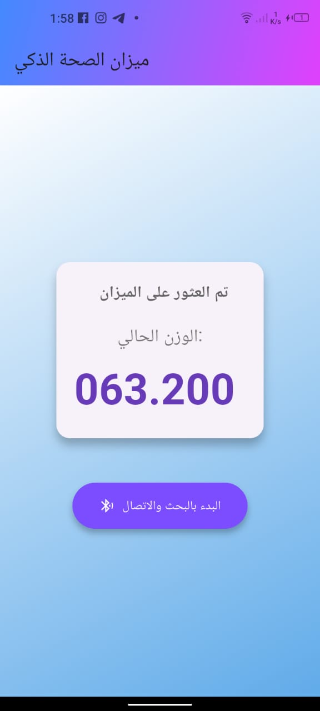
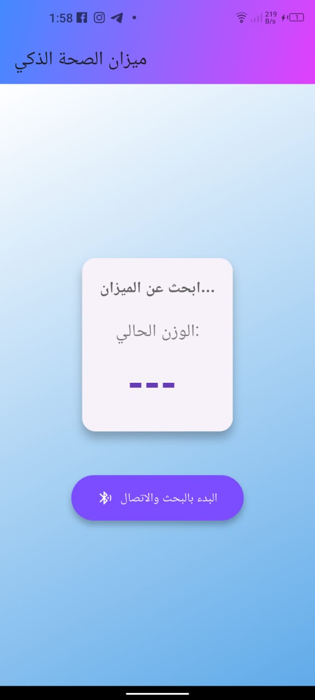
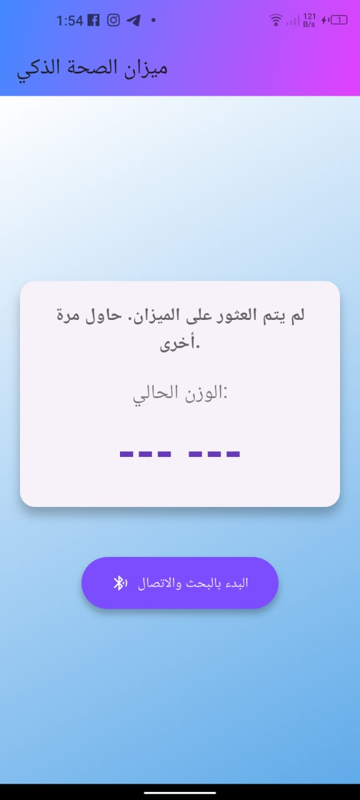

# Smart Scale Connect

[](https://flutter.dev/)
[](https://dart.dev/)
[](LICENSE)

## Project Overview

This project is a Flutter application designed to connect with an OKOK-compatible smart scale (or one based on Chipsea chipsets) via Bluetooth Low Energy (BLE). The application provides a user-friendly interface to discover the scale, connect to it, and receive real-time weight data, parsing and displaying it clearly. This project aims to offer an alternative to relying solely on official scale applications, allowing users and developers to integrate weight data into their custom systems.

## Key Features

* **Device Discovery:** Efficient scanning for Bluetooth devices to identify compatible smart scales.
* **Connection & Pairing:** Establishing a stable and reliable BLE connection with the scale.
* **Data Reception:** Receiving raw weight data from the scale as soon as a measurement is taken.
* **Protocol Parsing:** Decrypting the raw data received from the scale using the custom OKOK Protocol (version `0xCA`), including:
    * Checksum (XOR) validation for data integrity.
    * Extracting raw weight values.
    * Identifying measurement units (KG, LB, Jin, ST:LB).
    * Determining the number of decimal places for the weight.
* **Intuitive UI:** Displaying current weight and connection status with a modern and intuitive design.
* **Bluetooth State Management:** Checking Bluetooth adapter status and prompting the user to enable it if turned off.

## Challenges Encountered

* **Custom Communication Protocol:** A significant challenge was understanding and reverse-engineering the OKOK BLE Protocol, for which comprehensive public documentation is scarce. The project relied on partial documentation and analyzing device behavior.
* **Connection Establishment:** The scale's BLE interface might require a specific sequence or "handshake" to establish a successful connection, which could lead to errors like `ANDROID_SPECIFIC_ERROR` or `Timed out`. This necessitates precise experimentation and inspection using tools like nRF Connect.

## Prerequisites

To build and run this project, you will need:

* [Flutter SDK](https://flutter.dev/docs/get-started/install) (version 3.x.x or later recommended)
* An Android device (Android 6.0 Marshmallow or newer) or iOS device (iOS 11.0 or newer) with BLE support.
* An OKOK / Chipsea compatible smart scale (e.g., "Chipsea-BLE").

## How to Run

1.  **Clone the repository:**
    ```bash
    git clone [https://github.com/rawanabuzir/bodylog.git](https://github.com/rawanabuzir/bodylog.git)
    cd bodylog
    ```

2.  **Get dependencies:**
    ```bash
    flutter pub get
    ```

3.  **Update MAC Address and Device Name (if applicable):**
    Open `lib/main.dart` (or your app's main page file) and update the `targetMacAddress` and `targetDeviceName` based on your specific scale's information, which you can obtain using a tool like [nRF Connect](https://www.nordicsemi.com/Products/Software-and-Tools/nRF-Connect-for-Mobile).

    ```dart

    final String targetDeviceName = "Your_Scale_Name";   // Replace with your scale's actual advertising name (e.g., Chipsea-BLE)
    ```

4.  **Run the application:**
    ```bash
    flutter run
    ```
    (Ensure your mobile device is connected and USB debugging is enabled).

5.  **Activate Bluetooth and the Scale:**
    Ensure Bluetooth is enabled on your mobile device. Once the app is running, activate your smart scale (typically by stepping on it for a few seconds) to make it start advertising and become discoverable and connectable.

## Permissions (Android)

The application requires the following permissions in your `android/app/src/main/AndroidManifest.xml` file:

```xml
<uses-permission android:name="android.permission.BLUETOOTH" />
<uses-permission android:name="android.permission.BLUETOOTH_ADMIN" />
<uses-permission android:name="android.permission.ACCESS_FINE_LOCATION" />
<uses-permission android:name="android.permission.ACCESS_COARSE_LOCATION" />
<uses-permission android:name="android.permission.BLUETOOTH_SCAN" android:usesPermissionFlags="neverForLocation" />
<uses-permission android:name="android.permission.BLUETOOTH_ADVERTISE" />
<uses-permission android:name="android.permission.BLUETOOTH_CONNECT" />






